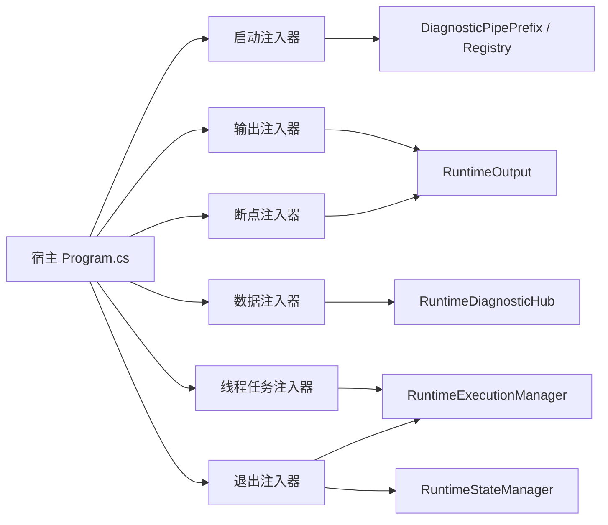

# 注入器标准化技术方案

> **状态**: DRAFT | **最后更新**: 2026-07-09
> **源码参考**: `Iwesun.Runtime.Diagnostics/RuntimeDiagnosticsServiceCollectionExtensions.cs`, `Iwesun.Runtime.Diagnostics/RuntimeOutput.cs`, `Iwesun.Runtime.Diagnostics/RuntimeDiagnosticHub.cs`, `Iwesun.Runtime.Diagnostics/RuntimeExecutionManagement.cs`, `Iwesun.Runtime.Diagnostics/RuntimeStateManager.cs`, `Iwesun.Runtime.Diagnostics/DiagnosticAssemblyAttributes.cs`

本文给出六大类注入器的技术方案。目标是把启动/退出做成统一标准模板，把输出/断点/数据/线程任务做成源代码里的标准标注化注入，最终写成最短、最稳定、最少打扰业务逻辑的形式。

## 技术选择

### 选择一：标准模板 + 标注化注入

采用两层结构：

- 启动/退出：固定宿主模板。
- 输出/断点/数据/线程任务：业务源代码里的标注化注入片段。

理由：

- 启动和退出必须统一，否则每个程序会有自己的生命周期写法。
- 业务过程只需要插入注入标注，不需要改写流程。
- 与现有 Runtime.Diagnostics 架构一致。

### 选择二：属性声明 + 运行时注册

启动、断点和可扫描注册点继续使用程序集特性声明：

- `DiagnosticPipePrefix`
- `DiagnosticWatchPoint`
- `DiagnosticBreakpoint`
- `DiagnosticHookableEvent`

理由：

- 声明集中。
- 宿主入口稳定。
- 适合做样板和发布模板。

### 选择三：静态模板片段，而不是预处理宏

C# 不引入真正宏机制，不做文本替换式注入，也不做隐式魔法。

采用的方式是：

- 最小插入片段。
- 固定命名。
- 固定调用边界。
- 固定白名单。

这会获得“像宏一样少写”的体验，但不会破坏可维护性。

## 推荐架构



## 最小实现边界

### 启动边界

- 放在固定宿主模板里。
- 只做服务注册、Hub 初始化、程序集注册表构建。
- 不写业务逻辑。

### 运行边界

- 放在 Worker 或 HostService。
- 只写状态推进、输出、断点、线程/任务状态变化。
- 不写复杂分支和恢复逻辑。

### 退出边界

- 放在固定宿主模板里。
- 只写 draining、completed、faulted、timeout 记录。
- 不再做新业务动作。

## 宏式写法建议

建议以后统一使用以下风格：

```csharp
HostTemplate.Start(builder, runtimeDirectory, Assembly.GetExecutingAssembly());
Injector.Data(hub, "sample.host", state);
Injector.Thread(execution, ...);
Injector.Output("sample.host.loop", ...);
Injector.Break("sample.host.pause", ...);
HostTemplate.Stop(stateManager, execution, ...);
```

这里的 `HostTemplate` 代表固定宿主模板，`Injector` 代表业务源代码里的标注化注入门面。最终命名可以落成：

- `RuntimeInject`。
- `RuntimeInjector`。
- `DiagnosticsInjector`。

命名目标是统一，不是固定某个词。

## 风险与约束

- 不能让业务依赖深层诊断 API。
- 不能把宏式体验做成隐式副作用。
- 不能让一个注入器做太多事。
- 不能把退出处理散落在多个 catch 中。

## 当前状态

本文的核心技术路线已经落到代码里，当前状态是“方案已实施出可用原型”。

- 标准模板：`RuntimeHostTemplate`。
- 标注化门面：`RuntimeInjector`。
- 样板宿主：`Iwesun.Runtime.SampleHost`。

后续如果继续推进，优先工作是补正式测试和完善命名收口。

## 相关文档

- 设计说明 → [INJECTOR_STANDARDIZATION.md](INJECTOR_STANDARDIZATION.md)
- 任务书 → [INJECTOR_STANDARDIZATION_TASKS.md](INJECTOR_STANDARDIZATION_TASKS.md)
- 样板宿主 → [SAMPLE_HOST.md](SAMPLE_HOST.md)