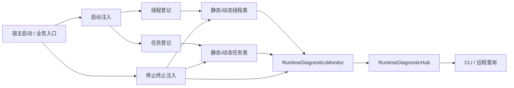

# 线程与任务管理

> **状态**: CURRENT | **最后更新**: 2026-07-09
> **源码参考**: `Iwesun.Runtime.Diagnostics/RuntimeExecutionManagement.cs`, `Iwesun.Runtime.Diagnostics/RuntimeDiagnosticsServiceCollectionExtensions.cs`, `Iwesun.Runtime.Diagnostics/RuntimeOutput.cs`, `Iwesun.Runtime.Diagnostics/DiagnosticSwitchboard.cs`, `Iwesun.Runtime.Diagnostics/RuntimeDiagnosticHub.cs`, `Iwesun.Runtime.Diagnostics/RuntimeDiagnosticsMonitor.cs`, `Iwesun.Runtime.Diagnostics/DiagnosticAssemblyAttributes.cs`, `Iwesun.Runtime.Diagnostics/RuntimeHostScanModels.cs`, `Iwesun.Runtime.SampleHost/Program.cs`

本文描述 Iwesun.Runtime.Diagnostics 里的“线程与任务管理”设计目标与当前实现进度。当前活跃实现已经覆盖运行时输出、开关板、断点管理、命名管道监控、反射目标，以及线程/任务管理基础管理器和样板宿主验证入口。样板宿主已演示静态/动态线程表、静态/动态任务表、并行协调/工作/监视循环和动态批次任务，但正式的生命周期登记 API、统一收尾编排和完整测试覆盖仍需继续补齐。

## 背景

现有诊断能力更接近“看见输出”和“看见控制面”，但还看不见“程序到底在做什么、做到了哪一步、哪些执行单元还活着、哪些执行单元已经结束”。

为了把运行时行为讲清楚，需要把执行状态拆成两层：

1. **线程层**：关注承载执行的运行通道。
2. **任务层**：关注在线程中划分出来的逻辑工作单元。

这里的“静态/动态”不是 C# `static` 的语义，而是**生命周期语义**：

- **静态**：进入后不会在正常运行分支中反复释放，通常属于长期常驻的执行入口。
- **动态**：会不断创建、执行、释放，生命周期短，数量多。

## 设计目标

- 让监控程序能够看到线程和任务的运行状态。
- 将线程与任务分别提供静态表和动态表。
- 支持源码级登记，而不是完全依赖运行时猜测。
- 让启动注入、线程/任务管理注入、停止终止注入形成统一标准。
- 保持诊断系统的被动观察属性，不替代业务决策。

## 非目标

- 不是完整的操作系统级线程分析器。
- 不是替代 Visual Studio 调试器或性能分析器。
- 不是自动推断所有业务任务的 AI 分类器。
- 不是把业务代码改成强依赖诊断框架的状态机。

## 术语

| 术语       | 含义                                                                             |
| ---------- | -------------------------------------------------------------------------------- |
| 静态线程表 | 记录长期常驻的线程入口、宿主循环、后台服务循环、监控泵等。                       |
| 动态线程表 | 记录会反复创建和回收的工作线程、临时执行线程、一次性后台通道。                   |
| 静态任务表 | 记录长期存在的逻辑任务，例如服务主循环中的固定阶段、长期守护任务、常驻协调任务。 |
| 动态任务表 | 记录按需创建、完成后释放的逻辑任务，例如一次扫描、一次同步、一次更新。           |
| 线程登记   | 把一个真实线程或逻辑线程通道注册进线程表。                                       |
| 任务登记   | 把一个逻辑工作单元注册进任务表。任务可以小于线程，也可以跨多个步骤。             |

## 总体结构

线程与任务管理应当被看成一条独立的运行时观测链，而不是附属于输出日志的附加字段。

## 数据模型

### 线程记录

线程记录应至少包含以下信息：

| 字段              | 说明                                                                                        |
| ----------------- | ------------------------------------------------------------------------------------------- |
| `Id`              | 全局唯一标识。                                                                              |
| `Name`            | 人类可读名称。                                                                              |
| `Lifetime`        | `Static` 或 `Dynamic`。                                                                     |
| `Kind`            | 宿主线程、工作线程、监控线程、协调线程等。                                                  |
| `Owner`           | 所属模块或服务名称。                                                                        |
| `SourceLocation`  | 源码登记位置。                                                                              |
| `ManagedThreadId` | 当前托管线程号。                                                                            |
| `NativeThreadId`  | 可用时记录本机线程号。                                                                      |
| `State`           | `Registered`、`Running`、`Draining`、`Completed`、`Faulted`、`Cancelled`、`ForcedExit` 等。 |
| `StartedAt`       | 启动时间。                                                                                  |
| `LastHeartbeatAt` | 最近一次心跳时间。                                                                          |
| `ExitedAt`        | 退出时间。                                                                                  |
| `CurrentTaskId`   | 当前绑定任务。                                                                              |
| `Tags`            | 业务标签或诊断标签。                                                                        |
| `Payload`         | 结构化上下文，避免存敏感信息。                                                              |

### 任务记录

任务比线程更细，适合描述“线程里正在做的事”。任务记录应至少包含：

| 字段              | 说明                                                                                  |
| ----------------- | ------------------------------------------------------------------------------------- |
| `Id`              | 全局唯一标识。                                                                        |
| `Name`            | 逻辑任务名称。                                                                        |
| `Lifetime`        | `Static` 或 `Dynamic`。                                                               |
| `Category`        | 任务分类，例如 `scan`、`heartbeat`、`sync`、`shutdown`。                              |
| `SourceLocation`  | 源码登记位置。                                                                        |
| `ThreadId`        | 当前承载线程。                                                                        |
| `ParentTaskId`    | 上级任务，可为空。                                                                    |
| `State`           | `Registered`、`Running`、`Waiting`、`Completed`、`Faulted`、`Cancelled`、`Draining`。 |
| `Step`            | 当前步骤。                                                                            |
| `StartedAt`       | 任务开始时间。                                                                        |
| `CompletedAt`     | 任务结束时间。                                                                        |
| `LastHeartbeatAt` | 最近一次进度更新。                                                                    |
| `Error`           | 失败摘要。                                                                            |
| `Payload`         | 结构化上下文。                                                                        |

## 静态表与动态表

线程和任务都要分静态表与动态表，而不是只放在一张“大表”里：

- **静态表**：长期常驻，强调稳定身份、长期可查、生命周期覆盖整个宿主运行。
- **动态表**：短生命周期，强调高频创建/释放、快速回收、统计视图聚合。

这样做的原因是：

1. 静态记录需要稳定定位，适合做源代码注入和长期观察。
2. 动态记录会快速变化，适合做运行过程分析和短时追踪。
3. 监控界面可以分别展示“常驻结构”和“当前活跃工作集”。

## 源码注入登记

线程和任务必须通过源码登记进入诊断系统，不能只靠运行时猜测。

登记应满足三个层次：

1. **静态定义**：在源码中声明这个线程/任务是什么、属于哪个分支、生命周期如何。
2. **运行时挂接**：在真正进入执行前登记，在执行过程中持续心跳或刷新状态。
3. **退出收尾**：在退出前更新完成态、错误态或终止态。

### 推荐的登记边界

- 线程入口处登记线程。
- 任务入口处登记任务。
- 线程循环中的关键阶段更新任务状态。
- 任务完成、失败、取消、超时、强制退出时都要落状态。

### 任务小于线程

任务不是线程的同义词。一个线程里可以有多个任务，一个任务也可能跨多个步骤，但任务必须能独立说明“这件事做到哪了”。

## 启动注入

启动注入是整个标准化注入的第一部分，要求监控能力在宿主运行的最早阶段就被接入。

当前 Runtime.Diagnostics 已存在的启动链路是：

1. `DiagnosticPipePrefix.InitializeFromAssembly(...)`
2. `services.AddRuntimeDiagnostics(...)`
3. `host.Services.UseRuntimeDiagnostics()`
4. `host.Services.BuildDiagnosticRegistries(...)`

新的启动注入要在这个基础上继续扩展，把线程/任务注册提前到业务循环启动之前。

启动阶段的要求：

- 监控程序要尽早进入可观测状态。
- 静态线程/任务定义要在业务开始前完成登记。
- 动态表可以在运行后继续增长，但表结构必须在启动时先初始化好。
- 启动阶段的失败不能悄悄吞掉，至少要记录到诊断事件里。

## 线程与任务管理注入

这一部分负责把运行分支变成可观测对象。

建议的逻辑是：

1. 线程进入时登记。
2. 任务进入时登记。
3. 运行中按心跳/步骤推进状态。
4. 线程退出时更新线程表。
5. 任务结束时更新任务表。

监控侧至少应当能看见：

- 哪些线程是常驻的。
- 哪些线程是临时的。
- 哪些任务在运行。
- 哪些任务卡住了。
- 哪些任务已经完成但线程仍在运行。

## 停止终止注入

停止终止注入是第三部分，目标不是“直接退出”，而是“按标准服务程序退出”。

推荐的终止顺序是：

1. 发出停止信号。
2. 各线程进入紧急收尾阶段。
3. 任务进入 draining 状态，不再创建新的工作。
4. 监控等待各线程和任务确认退出。
5. 若在超时内全部结束，则正常退出。
6. 若超时未结束，则按异常退出路径处理，并记录超时原因。

这个阶段的核心是：**优先可控收尾，其次超时兜底**。

## 与现有诊断系统的关系

线程与任务管理不是要替换现有诊断能力，而是要补齐现有能力的盲区：

- 运行时输出负责“发生了什么”。
- 断点管理负责“暂停并观察”。
- 线程/任务管理负责“谁在执行、执行到哪、什么时候该收尾”。
- 停止终止管理负责“如何有序收场”。

## 输出点建议

下面这些输出点只是设计建议，当前还未实现：

- `thread.register`
- `thread.heartbeat`
- `thread.complete`
- `thread.faulted`
- `task.register`
- `task.step`
- `task.complete`
- `task.faulted`
- `lifecycle.startup`
- `lifecycle.shutdown.requested`
- `lifecycle.shutdown.completed`
- `lifecycle.shutdown.timeout`

## 当前状态

线程与任务管理已经完成第一版基础闭环：

- `RuntimeExecutionManager` 已实现线程/任务注册、状态推进、心跳和快照。
- `runtime.execution` 已暴露给诊断 Hub，便于查询和注入。
- `Iwesun.Runtime.SampleHost` 已接入执行管理器，并演示静态/动态数据、三路并行循环和动态批次任务。

当前仍需补齐的部分是：

- 更完整的生命周期登记 API。
- 更细的线程/任务状态映射规则。
- 停止收尾的统一编排。
- 针对线程/任务语义的测试覆盖。

## 相关文档

- 状态分类基础类型 → [STATE_CLASSIFICATION.md](STATE_CLASSIFICATION.md)
- 实施计划 → [THREAD_TASK_MANAGEMENT_PLAN.md](THREAD_TASK_MANAGEMENT_PLAN.md)
- 进程/线程标准注入 → [PROCESS_THREAD_INJECTION.md](PROCESS_THREAD_INJECTION.md)
- 运行时诊断总览 → [RUNTIME_DIAGNOSTICS.md](../RUNTIME_DIAGNOSTICS.md)
- CLI 使用 → [IWESUN_RUNTIME_CLI.md](../IWESUN_RUNTIME_CLI.md)
