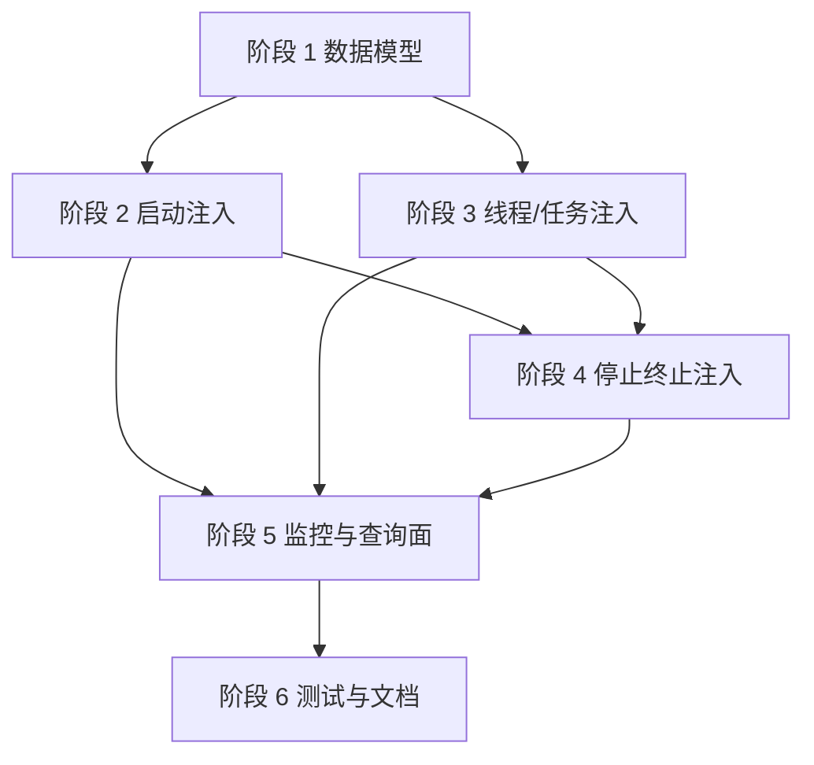

# 线程与任务管理实施计划

> **状态**: DRAFT | **最后更新**: 2026-07-09
> **源码参考**: `Iwesun.Runtime.Diagnostics/RuntimeDiagnosticsServiceCollectionExtensions.cs`, `Iwesun.Runtime.Diagnostics/RuntimeDiagnosticsMonitor.cs`, `Iwesun.Runtime.Diagnostics/RuntimeDiagnosticHub.cs`, `Iwesun.Runtime.Diagnostics/RuntimeOutput.cs`, `Iwesun.Runtime.Diagnostics/DiagnosticAssemblyAttributes.cs`, `Iwesun.Runtime.Diagnostics/RuntimeHostScanModels.cs`

本文是 [线程与任务管理](THREAD_TASK_MANAGEMENT.md) 的实施计划。当前这些能力尚未实现，本计划用于把工作拆成可执行阶段，避免把“线程/任务管理”“启动注入”“停止终止注入”混成一团。

## 目标拆分

本次实施分成三条主线：

1. **线程与任务管理**：建立静态表和动态表，支持源码登记、运行时刷新和查询。
2. **启动注入标准化**：让监控在宿主启动最早阶段接入，并完成静态注册。
3. **停止终止注入标准化**：把退出过程变成可观测、可等待、可超时兜底的流程。

## 实施原则

- 先定义数据模型，再接入生命周期。
- 先做静态定义，再做动态刷新。
- 先把可查询做出来，再补控制面。
- 先保证不破坏现有诊断链路，再扩展新能力。
- 任何停止逻辑都必须有超时兜底，不能只靠理想路径。

## 阶段 1：数据模型与注册骨架

### 交付内容

- 线程记录模型。
- 任务记录模型。
- 静态表与动态表的存储骨架。
- 注册/注销/心跳/状态迁移的统一约定。

### 任务清单

1. 明确线程和任务的最小字段集。
2. 定义静态/动态表的分层方式。
3. 定义生命周期状态枚举。
4. 定义查询视图所需的快照结构。
5. 明确哪些字段可以公开，哪些字段只保留在内部。

### 验收标准

- 能清楚区分静态与动态记录。
- 能从源码登记点唯一定位一条线程或任务记录。
- 能表达当前状态、起止时间和最后心跳。

## 阶段 2：启动注入标准化

### 交付内容

- 启动阶段注入顺序说明。
- 启动阶段注册入口。
- 启动失败记录和恢复策略。

### 任务清单

1. 统一宿主启动入口的注入顺序。
2. 确保监控实例在业务循环之前接入。
3. 在启动阶段完成静态线程/任务注册。
4. 将启动失败、配置失败、注册失败写入诊断事件。

### 验收标准

- 监控在宿主主要工作开始前就已可用。
- 静态表在启动完成后是完整可查的。
- 启动失败不会静默吞掉。

## 阶段 3：线程与任务管理注入

### 交付内容

- 源码登记约定。
- 线程进入/退出更新。
- 任务进入/步骤/完成更新。
- 心跳和卡住检测视图。

### 任务清单

1. 为线程入口添加登记。
2. 为任务入口添加登记。
3. 为运行循环添加心跳刷新。
4. 为完成、失败、取消、超时添加状态迁移。
5. 将线程和任务绑定到监控快照中。

### 验收标准

- 动态线程与动态任务可以实时变化。
- 每个活跃任务都能映射回承载它的线程。
- 长期常驻执行单元能稳定出现在静态表中。

## 阶段 4：停止终止注入

### 交付内容

- 停止信号模型。
- 收尾阶段状态。
- 超时兜底策略。
- 强制退出前的最终诊断记录。

### 任务清单

1. 定义停止请求的传播路径。
2. 定义线程和任务的 draining 状态。
3. 增加停止确认与完成确认。
4. 增加超时判定与异常退出记录。
5. 把终止流程纳入监控快照。

### 验收标准

- 正常退出路径可观测、可确认。
- 超时退出路径可观测、可追踪。
- 不允许无信号直接结束而没有记录。

## 阶段 5：监控与查询面

### 交付内容

- 线程表查询。
- 任务表查询。
- 静态/动态视图切换。
- 与现有 CLI / 管道查询模型对接。

### 任务清单

1. 扩展快照结构。
2. 暴露线程/任务查询结果。
3. 让 CLI 能按表、状态、名称、来源过滤。
4. 把新对象挂到 hub 查询面上。

### 验收标准

- 监控程序能查询到线程和任务表。
- 结构化快照能区分静态与动态。
- 结果对外只读，不把查询面做成控制面。

## 阶段 6：测试与文档

### 交付内容

- 单元测试。
- 生命周期测试。
- 启动/停止行为测试。
- 文档同步。

### 任务清单

1. 为登记、状态迁移、超时和释放补测试。
2. 为启动顺序补测试。
3. 为停止超时补测试。
4. 更新活跃文档入口。

### 验收标准

- 关键生命周期有测试覆盖。
- 文档与代码实现边界一致。
- 新增功能不会破坏现有诊断输出链路。

## 依赖顺序

## 风险点

1. 如果线程表和任务表没有分开，查询面会很快变得混乱。
2. 如果启动注入太晚，关键线程和任务会漏登记。
3. 如果停止注入没有超时兜底，宿主可能卡在退出阶段。
4. 如果任务定义没有比线程更细，任务管理会退化成“线程别名”。
5. 如果快照太重，监控查询会影响宿主运行。

## 当前状态

本计划对应的能力目前**尚未实现**。在实现之前，先按本文阶段顺序推进，避免把启动、运行、停止三个生命周期混成一次性改动。

## 相关文档

- 设计说明 → [THREAD_TASK_MANAGEMENT.md](THREAD_TASK_MANAGEMENT.md)
- 运行时诊断总览 → [RUNTIME_DIAGNOSTICS.md](../RUNTIME_DIAGNOSTICS.md)
- 文档索引 → [README.md](../README.md)
