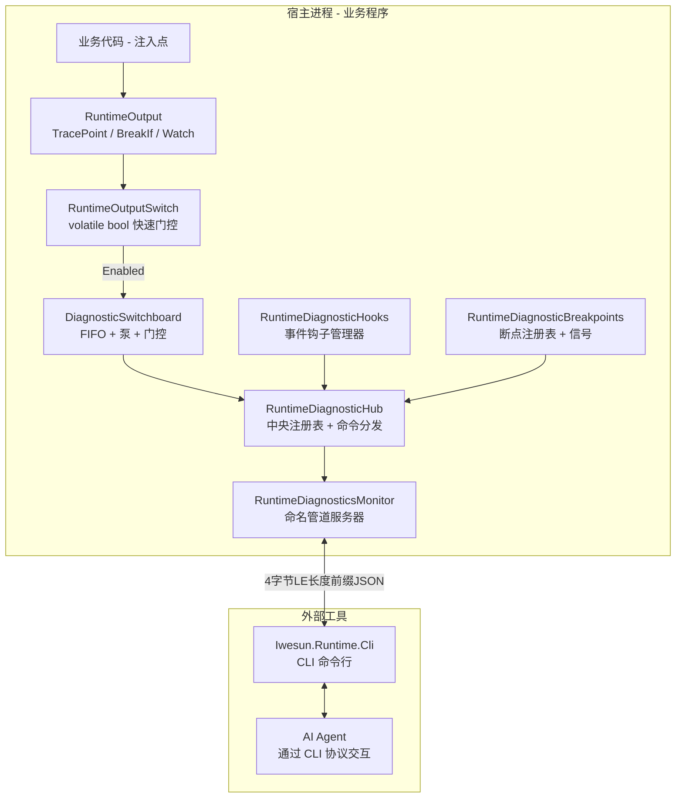
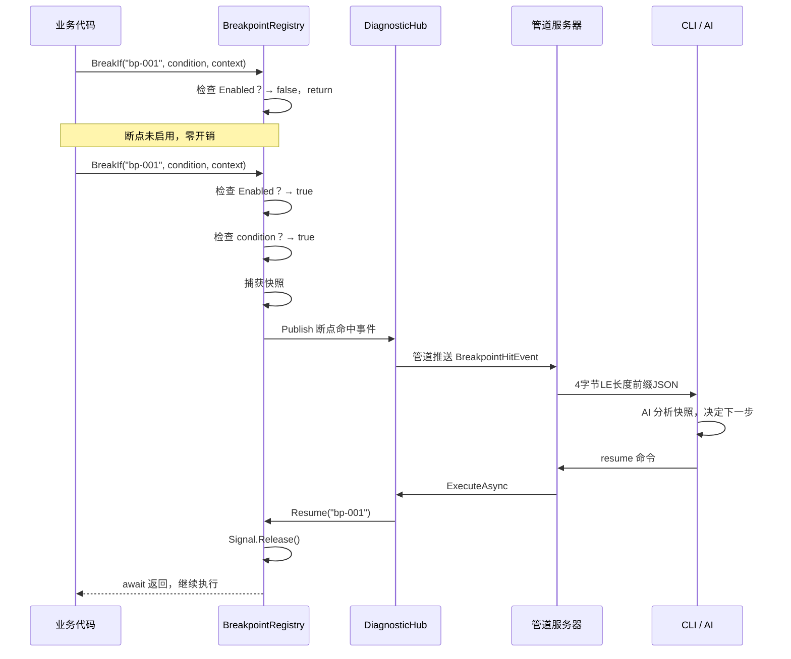

# AI 运行时调试工具 — 完整协议版本设计文档

> **状态**: IMPLEMENTED | **日期**: 2026-07-09 | **版本**: v1.0
> 
> Phase 1-4 全部实现完成，两个仓库构建通过（0 错误）。

---

## 目录

1. [愿景与定位](#1-愿景与定位)
2. [整体架构](#2-整体架构)
3. [注入代码模型](#3-注入代码模型)
4. [五大功能模块](#4-五大功能模块)
5. [四大核心注册表](#5-四大核心注册表)
6. [管道协议扩展](#6-管道协议扩展)
7. [宿主编译时管道名注入](#7-宿主编译时管道名注入)
8. [运行时注册表构建](#8-运行时注册表构建)
9. [断点系统详细设计](#9-断点系统详细设计)
10. [事件钩子系统设计](#10-事件钩子系统设计)
11. [对象反射访问设计](#11-对象反射访问设计)
12. [程序终止控制](#12-程序终止控制)
13. [安全与权限模型](#13-安全与权限模型)
14. [生产发布开关](#14-生产发布开关)
15. [实施路线图](#15-实施路线图)

---

## 1. 愿景与定位

### 1.1 要解决的问题

当前 AI 辅助调试只能依赖终端打印和日志文件——需要预先知道打印什么，调试效率低。本工具目标是：

- **运行时全面调试**：AI 通过 CLI 可以访问程序运行时的内存对象、运行状态
- **逻辑断点**：不是调试器断点（暂停全部线程），而是**协作式断点**（断一个点，其他继续运行）
- **生产可用**：数据输出功能在生产版本保留（作为 Log 日志），高级调试功能通过 `#if DEBUG` 编译开关屏蔽

### 1.2 核心设计原则

| 原则 | 说明 |
|------|------|
| **默认静默，零开销** | 关闭时所有注入代码退化为 `if (false)`，JIT 消除 |
| **协作式而非抢占式** | 断点 = `await`，不暂停线程，不破坏程序状态 |
| **注入代码极少** | 业务代码只需一行 `TracePoint` 调用或 `BreakIf` 调用 |
| **DLL 预编译，宿主绑定管道名** | 诊断 DLL 编译时不指定管道名，宿主编译时注入 |
| **反射不要求全面动态** | 反射访问对象靠 CLI 根据事件+注册表判断，不做全堆遍历 |
| **事件钩子需配合注入代码** | 不能 hook 的方法调用，需要在调用点显式注入监视点 |

---

## 2. 整体架构



### 2.1 组件职责

| 组件 | 类型 | 职责 |
|------|------|------|
| `RuntimeOutput` | static | 业务代码唯一入口：`Log`、`Trace`、`TracePoint`、`BreakIf`、`Watch`、`Error` |
| `RuntimeOutputSwitch` | static | 全局 `volatile bool Enabled`，零开销快速门控 |
| `DiagnosticSwitchboard` | static | FIFO 队列、后台泵、三级门控（全局/Section/Point）、管道/文件输出路由 |
| `RuntimeDiagnosticHooks` | singleton | 事件钩子注册表、弱引用 Attach/Detach、GC 清理 |
| `RuntimeDiagnosticBreakpoints` | singleton | 断点注册表、`await` 信号、命中快照、超时自动恢复 |
| `RuntimeDiagnosticHub` | singleton | 中央注册表：目标注册、命令分发、事件发布、主机扫描 |
| `RuntimeDiagnosticsMonitor` | BackgroundService | 命名管道服务器，多通道支持 |
| `Iwesun.Runtime.Cli` | standalone | CLI 命令行工具，AI 交互入口 |

---

## 3. 注入代码模型

### 3.1 核心机制：`volatile bool` + `InterpolatedStringHandler`

这是当前已实现的高速开关模式，所有新功能都复用此模式。

#### 开关（已实现）

```csharp
// RuntimeOutputSwitch.cs
public static class RuntimeOutputSwitch
{
    public static volatile bool Enabled;  // 单 bool，全局快速门控
}
```

#### 零开销字符串构建（已实现）

```csharp
// RuntimeOutputTextHandler.cs
[InterpolatedStringHandler]
public ref struct RuntimeOutputTextHandler
{
    public RuntimeOutputTextHandler(int literalLength, int formattedCount, out bool shouldAppend)
    {
        shouldAppend = RuntimeOutputSwitch.Enabled;  // 关闭时不构建字符串
        _builder = shouldAppend ? new StringBuilder(literalLength) : null;
    }
    // ... AppendLiteral / AppendFormatted ...
}
```

#### 业务代码调用方式

```csharp
// 零开销：关闭时 if(false) 被 JIT 消除，字符串不构建
RuntimeOutput.Log($"Processing {item.Id}");

// 监视输出：带 section/kind 分类
RuntimeOutput.TracePoint("pipeline.dns.update", "dns", "update", 
    "Updating DNS record", new { Domain = "example.com", Ip = "1.2.3.4" });

// 断点（新功能）
await RuntimeOutput.BreakIf("bp-dns-before-write", () => domain == "example.com");

// 对象监视（新功能）
RuntimeOutput.Watch("watch-user-session", userSession, "UserSession");
```

### 3.2 编译级索引非索引化（高速 if）

注入点 ID 是编译时常量字符串字面量。在 `RuntimeOutputSwitch.Enabled = false` 时：

```
源代码:   RuntimeOutput.TracePoint("pipeline.stage", "dns", "update", ...)
编译后:   编译器将字符串内联为常量
运行:     if (!RuntimeOutputSwitch.Enabled) return;
          JIT 分析: if (!false) return; → 不可达代码
结果:     整个 TracePoint 调用被 JIT 消除，零指令
```

这就是你描述的"X[i] 变成 X_89289329321"效果的 C# 实现——**编译时常量 ID + volatile bool 门控 + JIT 消除**。

---

## 4. 五大功能模块

### 4.1 模块一：数据监视输出（已实现 90%）

**功能**：注入代码输出数据，可选管道或文件输出。生产版本保留。

**注入代码**：
```csharp
RuntimeOutput.TracePoint("pipeline.dns.update", "dns", "update", message, payload);
RuntimeOutput.Log($"Status: {status}");
```

**输出路由**：PipeOutputEnabled → 管道 / FileOutputEnabled → 文件

**状态**：✅ 已实现（`RuntimeOutput.TracePoint`、`RuntimeOutput.Log`、`DiagnosticSwitchboard` 管道/文件输出）

---

### 4.2 模块二：断点启停（全新开发）

**核心理念**：不是调试器断点。是**协作式逻辑断点**——本质是 `await`，断一个点，其他代码继续运行。

**注入代码**：
```csharp
// 无条件断点
await RuntimeOutput.BreakIf("bp-dns-before-write");

// 条件断点（lambda 在断点启用时才求值）
await RuntimeOutput.BreakIf("bp-dns-before-write", () => domain == "example.com");

// 带上下文的断点
await RuntimeOutput.BreakIf("bp-pipeline-stage", 
    () => currentStage == "DnsUpdate", 
    new { domain, targetIp });
```

**工作流程**：
```
1. 业务代码调用 BreakIf("bp-001")
2. 检查 RuntimeOutputSwitch.Enabled → 如果 false，直接返回
3. 查找断点注册表 → 如果断点未启用，直接返回
4. 如果条件不满足，直接返回
5. 断点启用 + 条件满足：
   a. 捕获当前上下文快照
   b. 通过 FIFO 发送断点命中事件到 CLI
   c. await SemaphoreSlim.WaitAsync()  ← 阻塞当前调用链
   d. CLI 分析快照，执行反射操作
   e. CLI 发送 resume 命令
   f. SemaphoreSlim.Release() → await 返回
   g. 业务代码继续执行
```

**关键特性**：
- 只断当前调用链，其他线程/任务不受影响
- 超时自动恢复（默认 30 秒）
- 命中计数（`hit >= 3` 才暂停）
- `#if DEBUG` 编译开关屏蔽

**状态**：✅ 已实现（`RuntimeDiagnosticBreakpoints` + `RuntimeOutput.BreakIf` + `BreakpointHelper`）

**核心理念**：不要求全面动态反射。CLI 根据断点快照和事件钩子数据**自主判断**需要访问什么对象。反射是**按需的、目标明确的**。

**已实现**：
- `ReflectionRuntimeDiagnosticTarget`：public/non-public 属性/字段读写
- `BindingFlags.NonPublic` 突破 private/protected

**需增强**：对象路径导航（`user.Profile.Addresses[0].City`）

**状态**：✅ 已实现（`ReflectionRuntimeDiagnosticTarget` + `navigate` action + dot 路径 + 索引器）

---

### 4.4 模块四：事件钩子（全新开发，需配合注入代码）

**核心理念**：不能 hook 的方法调用，在调用点显式注入监视点。事件钩子配合注入代码一起使用。

**两种方式**：

**方式 A：反射 Hook（对已有的 event 事件）**
```csharp
// CLI 通过管道命令附加
// 诊断 DLL 内部：反射获取 EventInfo → AddEventHandler → 弱引用包装
```

**方式 B：注入代码监视点（对不能 hook 的方法调用）**
```csharp
// 业务代码中显式注入
RuntimeOutput.Watch("watch-order-process", order, "Order");
```

**GC 安全**：实例事件使用 `WeakReference<T>` + 定时清理

**状态**：✅ 已实现（`RuntimeDiagnosticHooks` + 弱引用 Attach/Detach + GC 清理定时器 + 表达式树 handler）

```csharp
// 优雅关闭
_hostApplicationLifetime.StopApplication();
// 强制退出
Environment.Exit(0);
```

**状态**：✅ 已实现（`DiagnosticSwitchboardTarget` shutdown action + `ShutdownRequested` 事件 + CLI 断开自动 `ResumeAllBreakpoints`）

---

## 5. 四大核心注册表

### 5.1 注册表总览

```
监视点注册表   → 编译时扫描 [assembly: DiagnosticWatchPoint] 特性
断点注册表     → 编译时扫描 [assembly: DiagnosticBreakpoint] 特性  
事件钩子注册表 → 编译时扫描 [assembly: DiagnosticHookableEvent] 特性
管道注册表     → 运行时 DI 初始化 + 宿主指定管道名前缀
```

所有注册表可通过管道查询，可导出为 `diagnostic-registry.json`。

### 5.2 注册表一：监视点注册表

```csharp
public sealed record WatchPoint(
    string Id, string Section, string Kind, string Description,
    string SourceLocation, string? ObjectPath, bool Enabled, long HitCount
);
```

### 5.3 注册表二：断点注册表（含一对一 await 信号）

```csharp
public sealed record Breakpoint(
    string Id, string Section, string Description, string SourceLocation,
    string? Condition, bool Enabled, int HitCountTarget, int TimeoutMs,
    bool AutoResume, long HitCount, bool IsWaiting,
    SemaphoreSlim Signal    // ← 每个断点独立的 await 信号
);
```

### 5.4 注册表三：事件钩子注册表

```csharp
public sealed record Hook(
    string HookId, string EventName, string TargetTypeName,
    bool IsStatic, WeakReference<object>? WeakTarget,
    Delegate? Handler, long HitCount, DateTime AttachedAt
);
```

### 5.5 注册表四：管道注册表

```csharp
public sealed record PipeChannel(
    string Name, string Purpose, bool IsActive, int ConnectedClients
);
```

多通道设计：`{host}.Control`、`{host}.Data`、`{host}.Events`、`{host}.Breakpoints`

---

## 6. 管道协议扩展

### 6.1 当前协议（已实现）

| 项 | 值 |
|----|-----|
| 传输 | Windows 命名管道 |
| 帧格式 | 4 字节 LE 长度前缀 + UTF-8 JSON |
| 最大消息 | 1 MB |
| 请求模型 | `RuntimeDiagnosticFrame` |
| 响应模型 | `RuntimeDiagnosticFrame` |

### 6.2 新增消息类型

```csharp
// 断点命中通知（DLL → CLI，异步推送）
public sealed record BreakpointHitEvent(
    string BreakpointId, string Section, DateTimeOffset HitAt,
    long HitCount, object? Snapshot
);

// 断点恢复命令（CLI → DLL）
public sealed record BreakpointResumeCommand(string BreakpointId, bool ResumeAll = false);

// 事件钩子触发通知（DLL → CLI，异步推送）
public sealed record HookFiredEvent(
    string HookId, string EventName, DateTimeOffset FiredAt,
    long HitCount, object? Sender, object? EventArgs
);

// 钩子附加/分离命令
public sealed record HookAttachCommand(string HookId, string TypeName, string EventName, string? InstancePath);
public sealed record HookDetachCommand(string HookId);

// 关机命令
public sealed record ShutdownCommand(bool Graceful = true, int ExitCode = 0);

// 注册表查询
public sealed record RegistryQueryCommand(string RegistryKind);
```

### 6.3 扩展的 Hub action（已实现）

所有新 action 通过 `RuntimeDiagnosticHub.ExecuteAsync` 中的 TargetId 路由分发：

| TargetId | Action | 方向 | 说明 |
|----------|--------|------|------|
| `diagnostics.breakpoints` | `list` / `snapshot` | CLI -> DLL | 列出所有断点状态 |
| `diagnostics.breakpoints` | `enable` | CLI -> DLL | 启用断点（参数 `id`） |
| `diagnostics.breakpoints` | `disable` | CLI -> DLL | 禁用断点（参数 `id`） |
| `diagnostics.breakpoints` | `resume` | CLI -> DLL | 恢复断点（参数 `id`） |
| `diagnostics.breakpoints` | `resumeAll` | CLI -> DLL | 恢复所有等待中断点 |
| `diagnostics.hooks` | `list` / `available` | CLI -> DLL | 列出可用+活跃钩子 |
| `diagnostics.hooks` | `attach` | CLI -> DLL | 附加钩子（参数 `id`） |
| `diagnostics.hooks` | `detach` | CLI -> DLL | 分离钩子（参数 `id`） |
| `diagnostics.registry` | `list` | CLI -> DLL | 查询注册表（参数 `kind`: all/watchpoints/breakpoints/hooks） |
| `diagnostics.switchboard` | `shutdown` | CLI -> DLL | 程序终止（参数 `graceful`, `exitCode`） |
| `{reflectionTarget}` | `navigate` | CLI -> DLL | 对象路径导航（参数 `member`: dot 路径） |

加上原有的 `list`、`host`、`rescanHost`、`events`、`snapshot`、`get`、`set`、`invoke`、`enable`、`disable`、`setPipeOutput`、`setFileOutput`、`setFilePath`、`setFifoDepth`、`queryPoints`、`setOutputPoint`、`emitTest` 等 action，总计 **28+ 个 action**。

---

## 7. 宿主编译时管道名注入

### 7.1 问题

诊断 DLL 预编译时不知道宿主程序要用什么管道名。管道名必须在宿主程序编译时指定。

### 7.2 方案：程序集特性 + 运行时初始化

```csharp
// === 宿主程序 AssemblyInfo.cs ===
[assembly: DiagnosticPipePrefix("DdnsSnap")]

// === 诊断 DLL 内部实现 ===
public static class DiagnosticPipePrefix
{
    private static string _prefix = "Iwesun.Runtime";  // 默认值
    
    public static string Prefix => _prefix;
    
    // 从程序集特性读取
    public static void InitializeFromAssembly(Assembly hostAssembly)
    {
        var attr = hostAssembly.GetCustomAttribute<DiagnosticPipePrefixAttribute>();
        if (attr != null) _prefix = attr.Prefix;
    }
    
    // 解析管道名
    public static string Resolve(string channel) => $"{_prefix}.{channel}";
}

[AttributeUsage(AttributeTargets.Assembly, AllowMultiple = false)]
public sealed class DiagnosticPipePrefixAttribute : Attribute
{
    public string Prefix { get; }
    public DiagnosticPipePrefixAttribute(string prefix) => Prefix = prefix;
}
```

### 7.3 宿主集成代码

```csharp
// 宿主 Program.cs（最小集成，约 5 行）
public static void Main(string[] args)
{
    DiagnosticPipePrefix.InitializeFromAssembly(typeof(Program).Assembly);
    
    var builder = Host.CreateApplicationBuilder(args);
    builder.Services.AddRuntimeDiagnostics(runtimeDirectory);
    var host = builder.Build();
    host.Services.UseRuntimeDiagnostics();
    host.Run();
}
```

**编译后效果**：诊断 DLL 生成管道 `DdnsSnap.Control`、`DdnsSnap.Data` 等。

---

## 8. 运行时注册表构建

### 8.1 构建流程

```
程序启动
  → DI 容器构建
  → UseRuntimeDiagnostics() 触发初始化
    → 1. DiagnosticSwitchboard.Initialize(configStore)
    → 2. DiagnosticSwitchboard.Attach(hub)
    → 3. hub.Register(switchboardTarget)
    → 4. 扫描宿主程序集
         → 收集 [assembly: DiagnosticWatchPoint] 特性
         → 收集 [assembly: DiagnosticBreakpoint] 特性
         → 收集 [assembly: DiagnosticHookableEvent] 特性
         → 构建三大注册表（内存 ConcurrentDictionary）
    → 5. 从程序集特性读取管道名前缀
    → 6. 启动 RuntimeDiagnosticsMonitor（多通道）
    → 7. 注册表构建完成，可被 CLI 查询
```

### 8.2 程序集特性标记（编译时注入）

```csharp
// === 宿主程序 AssemblyInfo.cs ===

// 监视点声明
[assembly: DiagnosticWatchPoint("pipeline.dns.update", "dns", "update", 
    "DNS record update", "DdnsSnap.Service.Pipeline.DnsUpdateStage")]
[assembly: DiagnosticWatchPoint("agent.heartbeat", "agent", "heartbeat", 
    "Agent heartbeat sent", "DdnsSnap.Agent.Worker")]

// 断点声明
[assembly: DiagnosticBreakpoint("bp-dns-before-write", "dns", 
    "Breaks before DNS API write", "DdnsSnap.Core.DnsProviders.AliyunDnsProvider")]
[assembly: DiagnosticBreakpoint("bp-agent-register", "agent", 
    "Breaks during agent registration", "DdnsSnap.Agent.Worker")]

// 可 hook 事件声明
[assembly: DiagnosticHookableEvent("auth-login", typeof(AuthService), "UserLoggedIn")]
[assembly: DiagnosticHookableEvent("order-completed", typeof(OrderService), "OrderCompleted")]

// 管道名前缀
[assembly: DiagnosticPipePrefix("DdnsSnap")]
```

### 8.3 注册表输出

**管道查询**：
```json
{ "targetId": "diagnostics.registry", "action": "all" }
```

**响应**：
```json
{
  "success": true,
  "value": {
    "watchPoints": [...],
    "breakpoints": [
      { "id": "bp-dns-before-write", "section": "dns", "enabled": false, "hitCount": 0, "isWaiting": false }
    ],
    "hooks": [...],
    "pipes": [...]
  }
}
```

**配置文件导出**：`diagnostic-registry.json`（自动生成，包含所有注册表内容）

---

## 9. 断点系统详细设计

### 9.1 核心接口

```csharp
public static class RuntimeOutput
{
    // 现有方法...
    
    // 新增：断点方法
    public static async Task BreakIf(string breakpointId)
    {
        if (!RuntimeOutputSwitch.Enabled) return;
        await BreakpointRegistry.WaitAsync(breakpointId);
    }
    
    public static async Task BreakIf(string breakpointId, Func<bool> condition)
    {
        if (!RuntimeOutputSwitch.Enabled) return;
        if (!condition()) return;
        await BreakpointRegistry.WaitAsync(breakpointId);
    }
    
    public static async Task BreakIf(string breakpointId, Func<bool> condition, object context)
    {
        if (!RuntimeOutputSwitch.Enabled) return;
        if (!condition()) return;
        await BreakpointRegistry.WaitAsync(breakpointId, context);
    }
}
```

### 9.2 断点数据流



### 9.3 断点状态机

```
[已注册, Enabled=false] → Enable() → [已注册, Enabled=true]
[已注册, Enabled=true]  → Disable() → [已注册, Enabled=false]

[已注册, Enabled=true] + BreakIf() + 条件满足
    → [等待中, IsWaiting=true]
    → 超时或 Resume() → [已注册, Enabled=true]
```

### 9.4 超时机制

```csharp
// 每个断点可配置超时（默认 30 秒），超时自动恢复
```

### 9.5 生产发布屏蔽

```csharp
#if DEBUG
    await RuntimeOutput.BreakIf("bp-dns-before-write", () => domain == "example.com", new { domain, ip });
#endif
```

**Release 编译后**：`#if DEBUG` 块完全移除，零开销。

---

## 10. 事件钩子系统设计

### 10.1 设计原则

1. **事件钩子需要配合注入代码**：不能 hook 的方法调用，在调用点显式注入 `Watch` 监视点
2. **弱引用保护**：实例事件使用 `WeakReference<T>`，不阻止 GC
3. **静态事件需显式管理**：永久存活，必须显式 Detach

### 10.2 核心接口

```csharp
public sealed class RuntimeDiagnosticHooks
{
    public bool Attach(string hookId, Type targetType, string eventName, object? instance = null);
    public void Detach(string hookId);
    
    // 内部：使用表达式树构建通用事件处理程序
    // 触发时：捕获 sender/args → 管道通知 CLI
}
```

### 10.3 钩子触发时的数据流

```
事件触发 → Hook 处理程序 → 检查 WeakTarget 存活
  → 存活：捕获 sender/args 快照 → HookFiredEvent → Hub.Publish → 管道推送 CLI
  → 已回收：自动 Detach，发送清理通知
```

### 10.4 注入代码配合（不能 hook 的方法调用）

```csharp
// 业务代码中显式注入监视点
RuntimeOutput.Watch("watch-order-process", order, "Order");
await ValidateAsync(order);
RuntimeOutput.Watch("watch-order-validated", order, "Order");
```

---

## 11. 对象反射访问设计

### 11.1 设计原则

1. **不要求全面动态**：CLI 根据断点快照和事件钩子数据，**自主判断**需要访问什么对象
2. **按需反射**：只反射 CLI 明确请求的成员
3. **基础路径导航**：支持简单 dot 路径（`user.Profile.Addresses[0].City`）

### 11.2 核心接口

```csharp
// 扩展 ReflectionRuntimeDiagnosticTarget
// 新增 action: "navigate"
// member: "user.Profile.Addresses[0].City" → 逐级反射访问
// 支持属性、字段、索引器
```

### 11.3 CLI 使用方式

```
AI 收到断点快照：{ user: { id: "u123" } }

AI 分析：需要查看 user 的完整 Profile
→ 命令：{ targetId: "reflection", action: "navigate", member: "user.Profile" }
→ 响应：{ email: "test@example.com", addresses: [...] }

AI 进一步：需要查看第一个地址
→ 命令：{ targetId: "reflection", action: "navigate", member: "user.Profile.Addresses[0]" }
→ 响应：{ city: "Beijing", street: "..." }
```

---

## 12. 程序终止控制

```csharp
// 优雅关闭
_hostApplicationLifetime.StopApplication();

// 强制退出
Environment.Exit(0);
```

**断开时自动清理**：CLI 断开 → 自动 Detach 所有钩子 → 自动 Resume 所有断点

---

## 13. 安全与权限模型

| 层级 | 机制 | 说明 |
|------|------|------|
| 管道访问 | 命名管道 ACL | 仅本地进程可连接 |
| 反射访问 | `RuntimeDiagnosticObjectAccess` 白名单 | 可读/可写/可调用成员白名单 |
| 断点操作 | 仅 CLI 可 resume | 断点只能在 CLI 端恢复 |
| 事件钩子 | 仅可 hook 已标记的事件 | 程序集特性声明 |
| 程序终止 | 需确认 | 默认需要 grace period |

---

## 14. 生产发布开关

| 功能 | 生产版本 | 调试版本 |
|------|---------|---------|
| `TracePoint` / `Log` | ✅ 可用（默认关闭） | ✅ 可用 |
| `BreakIf` | ❌ 编译移除（`#if DEBUG`） | ✅ 可用 |
| `Watch` | ❌ 编译移除（`#if DEBUG`） | ✅ 可用 |
| 事件钩子 | ❌ 编译移除 | ✅ 可用 |
| 反射访问（只读） | ✅ 始终可用 | ✅ 完全可用 |
| 程序终止 | ✅ 始终可用 | ✅ 可用 |

---

## 15. 实施路线图

### Phase 1：核心基础设施 ✅ 已完成

```
├── ✅ 断点注册表 + BreakIf + await 信号 (RuntimeDiagnosticBreakpoints.cs)
├── ✅ 断点超时机制 (Timer + CancellationTokenSource)
├── ✅ 管道协议扩展 (Hub breakpoint action)
├── ✅ 管道名前缀注入机制 (DiagnosticPipePrefix.cs)
└── ✅ CLI 断点控制命令 (bp-list/bp-enable/bp-disable/bp-resume/bp-resume-all)
```

### Phase 2：注册表与事件钩子 ✅ 已完成

```
├── ✅ 程序集特性扫描 + 注册表构建 (DiagnosticAssemblyAttributes.cs + RegistryBuilder.cs)
├── ✅ 事件钩子注册表 + Attach/Detach (RuntimeDiagnosticHooks.cs)
├── ✅ 弱引用事件钩子 + GC 清理 (WeakReference + Timer)
├── ✅ 注册表查询 API (Hub registry action)
└── ✅ DI 注册 (BuildDiagnosticRegistries extension method)
```

### Phase 3：反射增强与集成 ✅ 已完成

```
├── ✅ 对象路径导航 navigate (ReflectionRuntimeDiagnosticTarget)
├── ✅ 集合索引器访问 (IList/IDictionary)
├── ✅ 程序终止控制 (DiagnosticSwitchboardTarget shutdown action)
└── ✅ CLI 断开自动清理 (Hub.ResumeAllBreakpoints on pipe disconnect)
```

### Phase 4：CLI 集成与文档 ✅ 已完成

```
├── ✅ CLI 新增命令 (bp-*/hook-*/registry/navigate/shutdown)
├── ✅ AGENTS.md 更新 (五大模块/四大注册表/宿主集成说明)
├── ✅ 设计文档更新 (状态标记为 IMPLEMENTED)
└── ✅ 两个仓库构建验证 (Runtime 0 错误, DDNS Snap 0 错误)
```

---

## 附录 A：与现有代码的复用关系

| 现有组件 | 复用方式 | 改动 |
|---------|---------|------|
| `RuntimeOutputSwitch` | 直接复用，无需改动 | 无 |
| `RuntimeOutputTextHandler` | 直接复用 | 无 |
| `RuntimeOutput` | 扩展：`BreakIf` + `Watch` + `BreakpointHelper` | 中 |
| `DiagnosticSwitchboard` | 直接复用 | 无 |
| `RuntimeDiagnosticHub` | 扩展：断点/钩子/注册表 action | 大 |
| `RuntimeDiagnosticsMonitor` | 扩展：断开自动 `ResumeAllBreakpoints` | 小 |
| `RuntimeDiagnosticsServiceCollectionExtensions` | 扩展：注册 breakpoints/hooks + `BuildDiagnosticRegistries` | 中 |
| `ReflectionRuntimeDiagnosticTarget` | 扩展：`navigate` 路径导航 | 中 |
| `DiagnosticSwitchboardTarget` | 扩展：`shutdown` action | 小 |

## 附录 B：新增文件清单（已实现）

| 文件 | 功能 |
|------|------|
| `RuntimeDiagnosticBreakpoints.cs` | 断点注册表 + SemaphoreSlim 一对一 await 信号 + 超时自动恢复 |
| `DiagnosticPipePrefix.cs` | 管道名前缀注入（`[assembly: DiagnosticPipePrefix]`） |
| `DiagnosticAssemblyAttributes.cs` | 4 个程序集特性：WatchPoint/Breakpoint/HookableEvent/PipePrefix |
| `RegistryBuilder.cs` | 扫描宿主程序集特性构建三大注册表 |
| `RuntimeDiagnosticHooks.cs` | 事件钩子：弱引用 Attach/Detach + GC 清理 + 表达式树 handler |

## 附录 C：程序集特性清单（已实现）

```csharp
// DiagnosticAssemblyAttributes.cs 中定义：
[AttributeUsage(AttributeTargets.Assembly, AllowMultiple = true)]
public sealed class DiagnosticWatchPointAttribute : Attribute { ... }

[AttributeUsage(AttributeTargets.Assembly, AllowMultiple = true)]
public sealed class DiagnosticBreakpointAttribute : Attribute { ... }

[AttributeUsage(AttributeTargets.Assembly, AllowMultiple = true)]
public sealed class DiagnosticHookableEventAttribute : Attribute { ... }

[AttributeUsage(AttributeTargets.Assembly, AllowMultiple = false)]
public sealed class DiagnosticPipePrefixAttribute : Attribute { ... }
```

## 附录 D：完整 CLI 命令参考（已实现）

```bash
# 连接
iwesun-runtime-cli --pipe=DdnsSnap.RuntimeDiagnostics

# === 查询注册表 ===
> registry                          # 查询所有注册表
> registry watchpoints              # 查询监视点
> registry breakpoints              # 查询断点
> registry hooks                    # 查询钩子

# === 断点控制 ===
> bp-list                           # 列出所有断点
> bp-enable bp-001                  # 启用断点
> bp-disable bp-001                 # 禁用断点
> bp-resume bp-001                  # 恢复断点
> bp-resume-all                     # 恢复所有断点

# === 钩子控制 ===
> hook-list                         # 列出所有钩子（available + active）
> hook-attach hook-id               # 附加钩子
> hook-detach hook-id               # 分离钩子

# === 反射访问 ===
> get targetId member               # 读取成员
> set targetId member value         # 设置成员
> navigate targetId path            # 路径导航（如 Profile.Addresses[0].City）
> invoke targetId method            # 调用方法

# === 程序控制 ===
> shutdown                          # 优雅关闭
> shutdown --force                  # 强制退出

# === 原有命令（保持不变） ===
> snapshot / monitor / list / host / events / points
> enable / disable / set-pipe / set-file / emit
```

---

> **文档状态**: Phase 1-4 全部实现完成。Runtime 仓库 0 错误 0 警告，DDNS Snap 消费者 0 错误。
